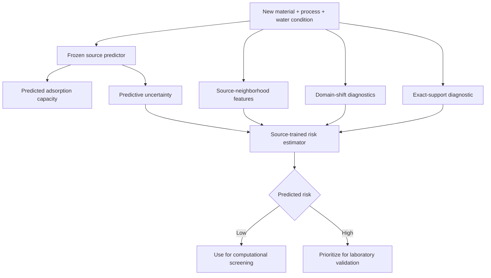
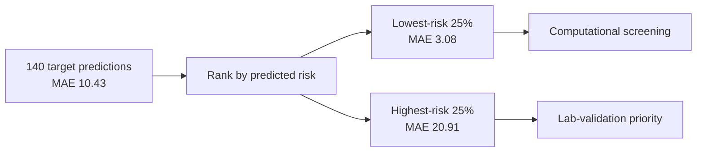
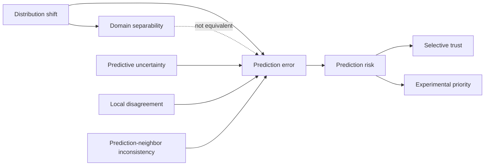
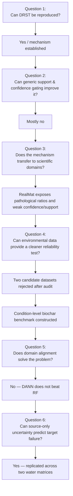

<div align="center">

# Adaptive-DRST

### Reliability-Aware Domain Adaptation for Scientific Prediction Under Distribution Shift

**From DRST reproduction → mechanism audits → materials transfer → environmental-remediation reliability**

<br>

[](#)
[](#)
[](#)
[](#)

<br>

> **Main finding:** under scientific domain shift, *domain similarity is not the same as prediction reliability*.  
> The most useful signal was predictive uncertainty: it consistently ranked high-error target predictions without using target labels for training.

</div>

---

## TL;DR

Adaptive-DRST started as an attempt to reproduce and extend **Distributionally Robust Self-Training (DRST)**.

The original objective was simple:

```text
reproduce DRST
→ improve adaptation
→ get better target accuracy
```

The experiments forced the project in a more interesting direction.

Across **VisDA-2017**, **computational → experimental materials transfer**, and **water-remediation prediction**, several intuitive adaptation signals repeatedly failed:

- high source support did **not** always imply low prediction error;
- domain-discriminator confidence did **not** reliably identify wrong predictions;
- stronger adversarial alignment did **not** necessarily produce the best scientific predictor;
- raw density-ratio weighting could become extremely heavy-tailed;
- pseudo-label confidence could fail to track correctness under strong shift.

The final project therefore asks a different question:

> **Can we estimate which scientific predictions are risky under domain shift, without using target labels to train the reliability model?**

For the final environmental benchmark, the answer was **yes**.

---

# Final results

## Environmental-remediation benchmark

Source domain:

**Lake water**

Target domains:

**Secondary effluent**  
**Ground water**

Prediction target:

**continuous adsorption capacity**

### Reliability performance

| Shift | Target N | Source-only RF MAE | Strict risk ↔ error Spearman | High-error AUROC | Low-risk quartile MAE | High-risk quartile MAE | High/low ratio |
|---|---:|---:|---:|---:|---:|---:|---:|
| Lake water → Secondary effluent | 140 | **10.43** | **0.651** | **0.836** | **3.08** | **20.91** | **6.80×** |
| Lake water → Ground water | 142 | **3.58** | **0.784** | **0.930** | **0.27** | **7.56** | **28.26×** |

### Strongest simple uncertainty baseline

| Shift | RF tree-std ↔ error Spearman | High-error AUROC |
|---|---:|---:|
| Secondary effluent | **0.651** | **0.846** |
| Ground water | **0.796** | **0.970** |

The composite risk model transferred well, but the simpler Random-Forest ensemble uncertainty signal remained slightly stronger on high-error discrimination.

That result is intentionally preserved.

---

# What Adaptive-DRST became

```mermaid
flowchart LR
    A["DRST reproduction"] --> B["VisDA mechanism experiments"]
    B --> C["Support / confidence / graph gating"]
    C --> D{"Reliable?"}
    D -- "Mostly no" --> E["RealMat materials transfer"]
    E --> F["Density-ratio + pseudo-label audit"]
    F --> G{"Reliable?"}
    G -- "No" --> H["Scientific benchmark redesign"]
    H --> I["Water-remediation dataset audits"]
    I --> J["Reject confounded datasets"]
    J --> K["Biochar EC benchmark"]
    K --> L["Source-only + DANN controls"]
    L --> M["Source-derived risk model"]
    M --> N["Selective prediction"]
    N --> O["Lab-validation prioritization"]
```



---

# Core research question

Given a scientific predictor

$$
\hat{y} = f_\theta(x),
$$

we want a second model that estimates whether the prediction is likely to fail:

$$
\hat{r}(x)
=
g_\phi
\left(
u_{\mathrm{ensemble}},
d_{\mathrm{NN}},
\sigma_{\mathrm{local}},
\Delta_{\mathrm{NN}},
p_{\mathrm{domain}},
s_{\mathrm{support}}
\right).
$$

The risk model is trained from **source out-of-fold errors**:

$$
e_i^{\mathrm{OOF}}
=
\left|
y_i-\hat y_i^{\mathrm{OOF}}
\right|.
$$

Target labels are **not** used to train the final reliability model.

At deployment:



The goal is not to replace experiments.

The goal is to **spend experiments where the model is most likely to be wrong**.

---

# Research stages

## 1. VisDA-2017

The project began with DRST / distributionally robust learning under domain shift.

Mechanisms explored included:

- DRL confidence
- domain support
- hard and soft reliability gating
- class-aware thresholds
- graph propagation
- prototype agreement
- neighborhood consistency
- pseudo-label stability
- component-level semantic structure

### Result

Several plausible extensions failed to improve adaptation consistently.

Instead of continuing to tune VisDA indefinitely, the project moved into scientific domains where distribution shift has physical meaning.

---

## 2. RealMat — computational → experimental materials

The RealMat branch tested whether DRST-style ideas survive a strong fidelity shift.

### Dataset scale

| Split | Samples |
|---|---:|
| Computational PBE | **60,218** |
| Experimental train | **1,534** |
| Experimental test | **171** |
| Total | **61,923** |

Structural coverage:

- **61,406** unique dataset MPIDs
- complete CIF coverage
- **17 structural descriptors**
- **0 descriptor extraction failures**

Examples of domain shift:

- number of elements: ~**−0.91 SMD**
- mean atomic number: ~**+0.81 SMD**
- mean atomic mass: ~**+0.79 SMD**

### Band-gap classification results

Threshold: **1.5 eV**

| Model | Accuracy | Balanced accuracy | Macro F1 |
|---|---:|---:|---:|
| Source-only logistic | 26.90% | 50.31% | 26.65% |
| Target-supervised reference | 61.40% | 66.23% | 52.80% |
| DANN | 61.40% | 60.42% | 50.93% |
| DRST-Mat v1 | 29.82% | 55.86% | 29.53% |

### Mechanism audit

| Diagnostic | Observation |
|---|---:|
| Domain ROC AUC | ~**0.804** |
| Maximum raw density ratio | ~**8,897** |
| Confidence correctness AUROC | ~**0.422** |
| Support correctness AUROC | ~**0.379** |
| Combined signal correctness AUROC | ~**0.375** |
| Target samples pseudo-labelable at 0.90 | **7** |

### Interpretation

The shift detector could distinguish domains, but its signals did **not** reliably rank prediction correctness.

This produced one of the project’s central conclusions:

> **Detecting distribution shift and predicting model error are different problems.**

---

# 3. Water-remediation dataset audits

The project next looked for a scientifically meaningful environmental benchmark.

It did **not** accept the first available dataset.

It audited experimental structure first.

---

## AquaFetch `mg_degradation`

Rejected as the primary benchmark.

Why:

- ~1,200 rows
- only **39** apparent trajectory groups
- only **9** matrix-stressed groups
- strong catalyst/matrix confounding

---

## AquaFetch `dye_removal`

Also rejected as the primary benchmark.

Key audit findings:

- **1,527** raw rows
- **161** exact duplicates
- **99** unique static experimental-condition groups
- repeated conflicting outcomes at the same final time
- Indigo and Melachite Green had **zero shared catalyst identities**
- broad matrix split was dye/catalyst confounded

A matched Melachite Green + 2 wt% Pd-BFO cohort produced:

- **25** total groups
- **16** controlled
- **9** matrix-stressed

but it was too small and still contained residual process variation.

The dataset remained useful as an exploratory stress-test, not as the primary benchmark.

---

# 4. Final environmental benchmark

The final benchmark uses a public **biochar / emerging-contaminant adsorption** dataset.

## Raw dataset

- **3,757** observations
- **29** recorded columns
- multiple wastewater matrices
- multiple adsorbents
- multiple pollutants
- synthesis descriptors
- physicochemical descriptors
- adsorption-process variables
- continuous adsorption capacity target

### Wastewater distribution

| Matrix | Raw rows |
|---|---:|
| Synthetic | 2,326 |
| Lake water | 693 |
| Secondary effluent | 486 |
| Ground water | 252 |

---

# 5. Condition-level experimental design

Raw rows were not treated as independent examples.

Audit results:

- exact duplicate rows: **245**
- unique recorded input conditions: **1,352**
- repeated input conditions: **1,026**
- repeated conditions with conflicting capacity: **951**
- maximum within-condition capacity spread: **181.97**

Final condition-level dataset:

| Matrix | Unique conditions |
|---|---:|
| Synthetic | 748 |
| Lake water | **322** |
| Ground water | **142** |
| Secondary effluent | **140** |

This prevented repeated-condition leakage across train/test partitions.

---

# 6. Domain-pair validation

Before modeling, the project checked whether the source and target domains shared comparable material/process conditions.

## Primary shift

### Lake water → Secondary effluent

- source: **322 conditions**
- target: **140 conditions**
- exact matched non-matrix signatures: **108**
- target exact-overlap coverage: **77.14%**
- exact-overlap pollutants:
  - DCF
  - IBU
  - NXP
  - NPX
- exact-overlap adsorbents:
  - NaOH-activated SCW biochars
  - Pristine SCW Biochar

Paired matrix effect:

- mean target − source shift: **−7.19**
- median shift: **−2.57**
- median absolute matrix effect: **4.97**
- 90th percentile absolute matrix effect: **23.08**
- paired capacity correlation: **0.988**

---

## Replication shift

### Lake water → Ground water

- source: **322**
- target: **142**
- exact shared signatures: **142**
- target overlap: **100%**
- pollutant: **IBU**
- shared adsorbents:
  - MCB
  - AMCB
  - CB

Paired matrix effect:

- mean shift: **+3.02**
- median shift: **+0.68**
- median absolute effect: **0.71**
- 90th percentile absolute effect: **9.77**
- paired correlation: **0.997**

---

# 7. Source-only prediction baseline

Model selection used **source labels only**.

### Lake-water source CV

| Model | CV MAE |
|---|---:|
| Dummy median | 36.35 |
| Ridge | 15.25 |
| **Random Forest** | **5.31** |
| Extra Trees | 5.73 |

Random Forest became the main source-only reference.

### Secondary-effluent target

| Metric | Value |
|---|---:|
| MAE | **10.43** |
| RMSE | **16.69** |
| $R^2$ | **0.911** |
| Spearman | **0.833** |
| Median absolute error | **5.47** |
| P90 absolute error | **23.00** |

A surprising result:

| Target subset | MAE |
|---|---:|
| Exact source-supported | **11.48** |
| Unsupported | **6.89** |

So:

> **Exact source support did not imply safer predictions.**

---

# 8. DANN control

A CPU-only neural control compared a source-only MLP with several fixed DANN strengths.

No target capacity labels were used for:

- training
- early stopping
- λ selection

### Multi-seed results

| Configuration | Target MAE | Target $R^2$ | Domain AUC |
|---|---:|---:|---:|
| MLP source-only | 11.37 | 0.868 | 0.814 |
| DANN λ=0.1 | 11.72 | 0.855 | 0.647 |
| DANN λ=0.5 | 12.37 | 0.847 | 0.633 |
| DANN λ=1.0 | **11.16** | 0.864 | **0.509** |
| **RF source-only reference** | **10.43** | **0.911** | — |

DANN λ=1.0 drove the domain AUC close to chance:

$$
\mathrm{AUC}_{domain}\approx 0.509
$$

but still did not beat the Random-Forest source-only predictor.

Therefore:

> **Domain confusion is not automatically predictive improvement.**

---

# 9. Reliability mechanism

The final reliability experiment trains a separate risk estimator from source-only information.

## Source OOF construction


Source OOF RF MAE:

**5.315**

Source OOF median error:

**0.880**

Source OOF 75th-percentile error:

**4.532**

---

## Strict reliability features

The primary risk model uses:

1. RF tree prediction standard deviation
2. mean distance to source neighbors
3. local source-label standard deviation
4. prediction-to-nearest-source-label gap
5. domain target probability
6. log target/source odds
7. exact support flag

The primary model intentionally **excludes absolute prediction magnitude**.

That makes the final test stricter.

---

# 10. Secondary-effluent reliability

### Prediction baseline

| Metric | Result |
|---|---:|
| MAE | **10.43** |
| RMSE | **16.69** |
| $R^2$ | **0.911** |
| Prediction Spearman | **0.833** |

### Shift diagnostics

- domain AUC: **0.825**
- exact supported target conditions: **108 / 140**
- supported-target MAE: **11.48**
- unsupported-target MAE: **6.89**

### Strict source-derived risk model

| Reliability metric | Result |
|---|---:|
| Risk ↔ absolute error Spearman | **0.651** |
| High-error AUROC | **0.836** |
| Lowest-risk quartile MAE | **3.08** |
| Highest-risk quartile MAE | **20.91** |
| High/low MAE ratio | **6.80×** |

### Selective prediction curve

| Coverage | N | MAE | Median AE | P90 AE |
|---:|---:|---:|---:|---:|
| **25%** | 35 | **3.08** | 3.24 | 5.30 |
| **50%** | 70 | **4.31** | 3.30 | 8.61 |
| **75%** | 105 | **6.94** | 4.29 | 16.91 |
| **100%** | 140 | **10.43** | 5.47 | 23.00 |



---

# 11. Ground-water replication

### Prediction baseline

| Metric | Result |
|---|---:|
| MAE | **3.58** |
| RMSE | **6.02** |
| $R^2$ | **0.963** |
| Prediction Spearman | **0.977** |

All **142 / 142** target conditions have exact source support.

Yet reliability remains highly informative.

### Strict risk model

| Reliability metric | Result |
|---|---:|
| Risk ↔ absolute error Spearman | **0.784** |
| High-error AUROC | **0.930** |
| Lowest-risk quartile MAE | **0.27** |
| Highest-risk quartile MAE | **7.56** |
| High/low MAE ratio | **28.26×** |

### Selective prediction

| Coverage | N | MAE | Median AE | P90 AE |
|---:|---:|---:|---:|---:|
| **25%** | 35 | **0.27** | 0.17 | 0.63 |
| **50%** | 71 | **0.42** | 0.26 | 0.98 |
| **75%** | 106 | **2.22** | 0.53 | 8.65 |
| **100%** | 142 | **3.58** | 0.77 | 9.84 |

The reliability effect therefore replicates across a second environmental matrix shift.

---

# 12. Deployment thresholds

The project also converts source risk into practical selective-prediction thresholds.

## Secondary effluent

| Source-risk quantile | Target coverage | Accepted MAE | Rejected MAE |
|---:|---:|---:|---:|
| 50th | 43.6% | **3.79** | **15.56** |
| 75th | 52.1% | **4.38** | **17.02** |
| 90th | 80.7% | **7.58** | **22.36** |

## Ground water

| Source-risk quantile | Target coverage | Accepted MAE | Rejected MAE |
|---:|---:|---:|---:|
| 50th | 73.9% | **2.16** | **7.63** |
| 75th | 94.4% | **3.08** | **11.98** |
| 90th | 97.9% | **3.38** | **12.77** |

The thresholds are derived from the **source-risk distribution**, not target labels.

---

# 13. What worked — and what did not

## Supported

- predictive ensemble uncertainty
- source-derived risk modeling
- selective prediction
- source OOF error as a reliability-learning target
- explicit condition-level experimental-design auditing
- replication across two water matrices

## Not supported as general reliability signals

- exact source support
- domain-target probability
- naive density-ratio weighting
- stronger domain confusion
- high confidence alone
- arbitrary pseudo-label gating

---

# 14. Negative-result ledger

| Hypothesis | Observation | Status |
|---|---|---|
| More source support means safer predictions | Supported target subset had **higher** MAE on Secondary Effluent | **Rejected** |
| Domain classifier score measures reliability | Weak/inverse target relationship | **Rejected** |
| Stronger domain alignment guarantees better prediction | DANN reached ~0.509 domain AUC but did not beat RF | **Rejected** |
| Raw density ratio is stable enough for direct weighting | Extreme ratios in RealMat | **Rejected** |
| Confidence reliably tracks shifted-domain correctness | Weak correctness AUROC | **Rejected** |
| Indigo → Melachite is a clean pollutant shift | Zero catalyst overlap | **Rejected** |
| Broad controlled → stressed AquaFetch split is clean | Catalyst/dye/process confounding | **Rejected** |
| Raw rows can be randomly split | Large repeated-condition structure | **Rejected** |
| Ensemble uncertainty ranks target error | Strong on both final domains | **Supported** |
| Source-trained composite risk transfers | Strong on both final domains | **Supported** |

---

# 15. Research interpretation

The project separates three quantities that are often treated as interchangeable:



### Domain separability

> Can we tell whether an input looks source-like or target-like?

### Predictive error

> Is this particular prediction likely to be wrong?

### Reliability

> Can we estimate that error risk without seeing the target label?

Adaptive-DRST found that these are not the same problem.

---

# 16. Practical use case

Imagine screening hundreds of adsorbent / pollutant / process combinations.

A conventional workflow:

```text
model prediction
→ rank candidates
→ test the top candidates
```

Adaptive-DRST:

```text
                         ┌────────────────────────┐
                         │ predicted adsorption   │
material + process ─────▶│ capacity               │
                         └────────────┬───────────┘
                                      │
                                      ▼
                         ┌────────────────────────┐
                         │ prediction-risk layer  │
                         └────────────┬───────────┘
                                      │
                    ┌─────────────────┴─────────────────┐
                    ▼                                   ▼
          lower predicted risk                higher predicted risk
          computational screening             laboratory priority
```

The objective is not simply to maximize benchmark accuracy.

It is to improve **experimental allocation**.

---

# 17. Repository structure

```text
Adaptive-drst/
│
├── experiments/
│   ├── materials/
│   │   ├── realmat_bag_descriptor_features.py
│   │   ├── realmat_bag_drst.py
│   │   └── realmat_bag_drst_mechanism_audit.py
│   │
│   └── water/
│       ├── dye_removal_dataset_audit.py
│       ├── photocatalysis_dataset_audit.py
│       ├── photocatalysis_experimental_design_audit.py
│       ├── water_drst_split_audit.py
│       ├── water_matched_matrix_audit.py
│       ├── water_exact_matrix_overlap_audit.py
│       ├── biochar_ec_candidate_audit.py
│       ├── biochar_ec_domain_pair_audit.py
│       ├── biochar_ec_source_only_regression.py
│       ├── biochar_ec_dann_regression.py
│       ├── biochar_ec_reliability_audit.py
│       └── biochar_ec_adaptive_drst_final.py
│
├── domains/
│   └── materials/
│       └── realmat_bag/
│           └── features/
│               ├── realmat_bag_drst_results.json
│               └── realmat_bag_drst_mechanism_audit.json
│
└── results/
    └── water/
        └── biochar_ec/
            ├── source_only/
            ├── dann_regression/
            ├── reliability_audit/
            └── adaptive_drst_final/
```

---

# 18. Run the environmental pipeline

## Environment

Designed for:

```text
Python 3.11
CPU-only PyTorch
NumPy
pandas
scikit-learn
```

Install:

```powershell
python -m pip install numpy pandas scikit-learn torch
```

Clone:

```powershell
git clone https://github.com/Vlastimir0500/Adaptive-drst.git
Set-Location ".\Adaptive-drst"
```

Run the benchmark-construction and final experiments in order:

```powershell
python ".\experiments\water\biochar_ec_candidate_audit.py"
python ".\experiments\water\biochar_ec_domain_pair_audit.py"
python ".\experiments\water\biochar_ec_source_only_regression.py"
python ".\experiments\water\biochar_ec_dann_regression.py"
python ".\experiments\water\biochar_ec_reliability_audit.py"
python ".\experiments\water\biochar_ec_adaptive_drst_final.py"
```

The audit steps are intentionally part of the pipeline.

The project does **not** jump directly from CSV to model training.

---

# 19. Final output files

The final experiment writes:

```text
results/water/biochar_ec/adaptive_drst_final/
│
├── cross_domain_reliability_summary.csv
├── final_experiment_metadata.json
│
├── secondary_effluent_deployment_thresholds.csv
├── secondary_effluent_selective_curve.csv
├── secondary_effluent_strict_risk_feature_importance.csv
├── secondary_effluent_target_predictions.csv
│
├── ground_water_deployment_thresholds.csv
├── ground_water_selective_curve.csv
├── ground_water_strict_risk_feature_importance.csv
└── ground_water_target_predictions.csv
```

---

# 20. Reproducibility rules used in the project

### No target-label model selection

Target capacity labels are not used to choose:

- source model
- DANN early stopping
- DANN λ
- reliability features
- risk-model training targets
- source-derived deployment thresholds

### No raw-row leakage

Repeated experimental conditions are collapsed before final environmental modeling.

### Multiple controls

The final benchmark includes:

- DummyRegressor
- Ridge
- Random Forest
- Extra Trees
- source-only MLP
- multi-seed DANN
- exact-support diagnostics
- domain-discriminator diagnostics
- neighborhood diagnostics
- ensemble uncertainty
- composite source-trained risk

### Negative results remain visible

Mechanisms are rejected when the evidence does not support them.

---

# 21. Main scientific conclusions

## 1. Domain shift ≠ prediction risk

A model can distinguish source from target without knowing which target predictions will be wrong.

## 2. Domain alignment ≠ predictive improvement

DANN can make the domains nearly indistinguishable while still underperforming a strong non-neural source-only predictor.

## 3. Exact source support ≠ safety

On Secondary Effluent:

```text
supported MAE   = 11.48
unsupported MAE =  6.89
```

The naive support heuristic points in the wrong direction.

## 4. Predictive uncertainty transfers

Random-Forest ensemble uncertainty strongly ranks target error across both matrix shifts.

## 5. Reliability enables selective prediction

Removing the highest-risk target predictions dramatically lowers retained-set error.

## 6. Experimental-design auditing is part of ML research

Several candidate water benchmarks had to be rejected before any adaptation model was trained.

---

# 22. Claim boundary

This project supports:

> **Source-trained uncertainty and risk signals can rank adsorption-prediction error under environmental matrix shift without using target labels for risk-model training.**

It does **not** claim:

- that the composite risk model universally beats ensemble uncertainty;
- that domain alignment always hurts or always helps;
- that observational matrix differences are causal effects;
- that low-risk predictions remove the need for experimental validation;
- that two target matrices constitute universal external validation.

The strongest next step would be a completely independent remediation dataset or prospective laboratory validation.

---

# 23. Project evolution



---

# 24. Status

```text
████████████████████  Core technical experiments complete
```

Completed:

- DRST reproduction / mechanism investigation
- VisDA adaptation experiments
- RealMat scientific-domain transfer
- RealMat DRST mechanism audit
- water-dataset screening
- confounding audits
- condition-level benchmark construction
- source-only regression
- neural source-only control
- multi-seed DANN
- source-derived reliability modeling
- selective-risk evaluation
- second-domain replication
- deployment-threshold analysis

---

# 25. References

### Distributionally Robust Learning / DRST

**Learning Calibrated Uncertainties for Domain Shift: A Distributionally Robust Learning Approach**

arXiv:2010.05784

https://arxiv.org/abs/2010.05784

Original implementation:

https://github.com/hatchetProject/Deep-Distributionally-Robust-Learning-for-Calibrated-Uncertainties-under-Domain-Shift

### Biochar / emerging-contaminant adsorption dataset

**Machine-learning-based prediction and optimization of emerging contaminants' adsorption capacity on biochar materials**

Public repository:

https://github.com/ZeeshanHJ/Adsorption-capacity-prediction-for-ECs

---

<div align="center">

# Final takeaway

### Adaptive-DRST did not become “another domain adaptation trick.”

It became an investigation of **what actually makes a scientific prediction trustworthy under distribution shift**.

<br>

**Domain similarity is not reliability.**

**Domain confusion is not reliability.**

**Exact support is not reliability.**

### Predictive uncertainty, however, can identify which shifted-domain predictions deserve experimental attention.

<br>

## Predict → estimate risk → validate where it matters

</div>
