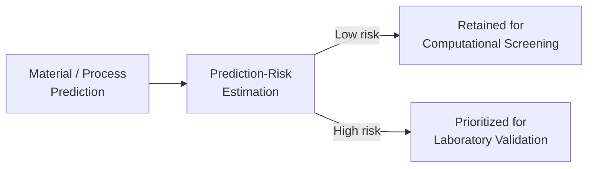
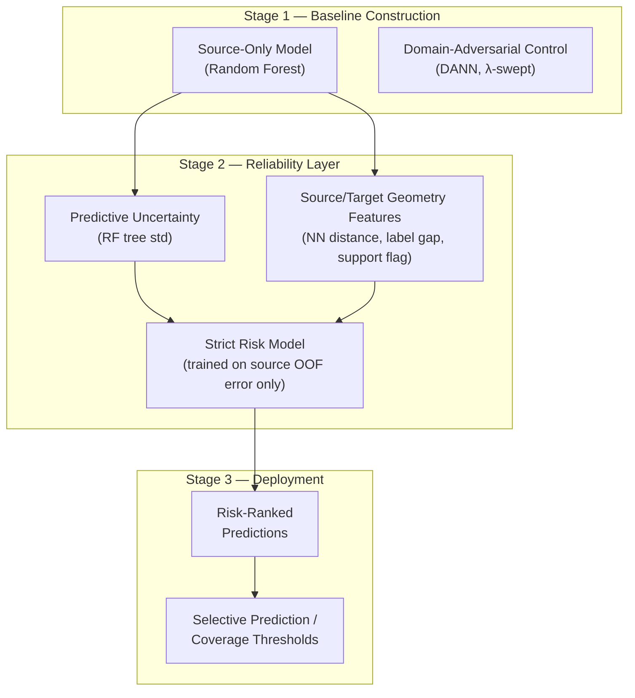
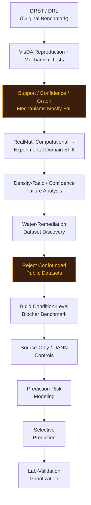
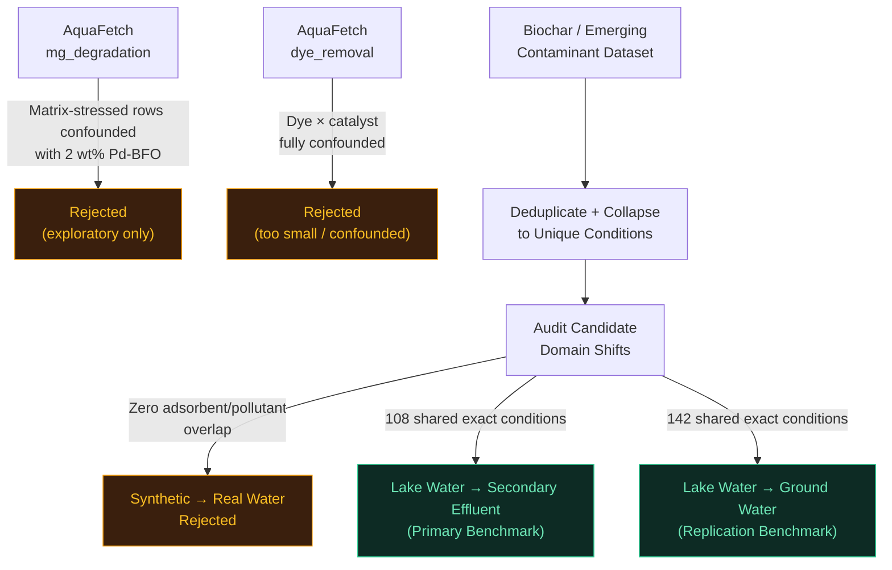
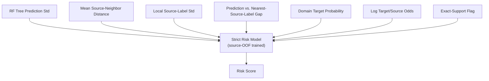
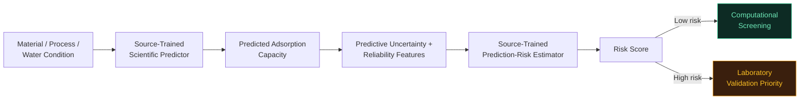

<p align="center">
<svg width="900" height="220" viewBox="0 0 900 220" xmlns="http://www.w3.org/2000/svg" role="img" aria-label="Adaptive-DRST animated hero banner">
  <defs>
    <linearGradient id="bgGrad" x1="0" y1="0" x2="1" y2="1">
      <stop offset="0%" stop-color="#05070d"/>
      <stop offset="100%" stop-color="#0d1424"/>
    </linearGradient>
    <linearGradient id="titleGrad" x1="0" y1="0" x2="1" y2="0">
      <stop offset="0%" stop-color="#22d3ee"/>
      <stop offset="55%" stop-color="#a78bfa"/>
      <stop offset="100%" stop-color="#34d399"/>
    </linearGradient>
  </defs>
  <rect width="900" height="220" rx="14" fill="url(#bgGrad)"/>
  <line x1="120" y1="165" x2="780" y2="165" stroke="#1f2a44" stroke-width="2"/>
  <circle cx="150" cy="165" r="8" fill="#22d3ee">
    <animate attributeName="r" values="6;10;6" dur="2.4s" repeatCount="indefinite"/>
  </circle>
  <text x="150" y="192" fill="#8ea3c7" font-size="12" text-anchor="middle" font-family="monospace">PREDICT</text>
  <circle cx="450" cy="165" r="8" fill="#a78bfa">
    <animate attributeName="r" values="6;10;6" dur="2.4s" begin="0.6s" repeatCount="indefinite"/>
  </circle>
  <text x="450" y="192" fill="#8ea3c7" font-size="12" text-anchor="middle" font-family="monospace">ESTIMATE RISK</text>
  <circle cx="750" cy="165" r="8" fill="#34d399">
    <animate attributeName="r" values="6;10;6" dur="2.4s" begin="1.2s" repeatCount="indefinite"/>
  </circle>
  <text x="750" y="192" fill="#8ea3c7" font-size="12" text-anchor="middle" font-family="monospace">VALIDATE</text>
  <circle r="4" fill="#f8fafc">
    <animateMotion dur="3.6s" repeatCount="indefinite" path="M120,165 L780,165"/>
  </circle>
  <text x="450" y="72" fill="url(#titleGrad)" font-size="40" font-weight="700" text-anchor="middle" font-family="Segoe UI, sans-serif" letter-spacing="2">ADAPTIVE-DRST</text>
  <text x="450" y="102" fill="#94a3b8" font-size="13.5" text-anchor="middle" font-family="Segoe UI, sans-serif">Reliability-Aware Domain Adaptation for Scientific Prediction Under Distribution Shift</text>
</svg>
</p>

<p align="center">


</p>

<p align="center"><i>Predict → estimate risk → validate where it matters.</i></p>

---

## Table of Contents

- [TL;DR](#tldr)
- [Final Results](#final-results)
- [Core Scientific Idea](#core-scientific-idea)
- [Research Trajectory](#research-trajectory)
- [Stage 1 — VisDA-2017](#stage-1--visda-2017)
- [Stage 2 — RealMat: Computational → Experimental Materials](#stage-2--realmat-computational--experimental-materials)
- [Stage 3 — Water Dataset Audits](#stage-3--water-dataset-audits)
- [Final Benchmark — Biochar / Emerging Contaminant Dataset](#final-benchmark--biochar--emerging-contaminant-dataset)
- [Condition-Level Experimental Design](#condition-level-experimental-design)
- [Source-Only Baseline](#source-only-baseline)
- [DANN Control](#dann-control)
- [Reliability Model](#reliability-model)
- [Results — Lake Water → Secondary Effluent](#results--lake-water--secondary-effluent)
- [Results — Lake Water → Ground Water](#results--lake-water--ground-water)
- [Selective Prediction](#selective-prediction)
- [Negative Results Ledger](#negative-results-ledger)
- [What Actually Worked](#what-actually-worked)
- [Practical Deployment](#practical-deployment)
- [Repository Structure](#repository-structure)
- [Reproducibility](#reproducibility)
- [Limitations & Claim Boundary](#limitations--claim-boundary)
- [References](#references)
- [Final Takeaway](#final-takeaway)

---

## TL;DR

- Started as an attempt to reproduce and extend **DRST / DRL** (Distributionally Robust Self-Training) on VisDA-2017.
- Most generic support / confidence / graph pseudo-labeling mechanisms **failed or were rejected** on VisDA — the project pivoted instead of stacking heuristics.
- Pivoted to a scientifically grounded question:
  > *Under domain shift, can we estimate which scientific predictions are likely to be wrong — without using target labels to train the reliability model?*
- Tested this across two real domains: **computational → experimental materials prediction** (RealMat band-gap) and **environmental adsorption capacity prediction** (biochar / emerging contaminants, lake water → secondary effluent / ground water).
- Multiple public water-remediation datasets were **audited and rejected** for confounding before a clean, condition-level biochar benchmark was built.
- The final finding: **domain similarity and exact source support are not reliability signals** — but a **source-trained predictive-uncertainty + risk model** ranks target prediction error well enough to support **selective prediction** and **lab-validation prioritization**, without ever training on target labels.

---

## Final Results

<p align="center">
<svg width="700" height="90" viewBox="0 0 700 90" xmlns="http://www.w3.org/2000/svg" role="img" aria-label="animated uncertainty waveform">
  <rect width="700" height="90" fill="#05070d" rx="10"/>
  <path d="M0,45 Q35,10 70,45 T140,45 T210,45 T280,45 T350,45 T420,45 T490,45 T560,45 T630,45 T700,45"
        fill="none" stroke="#22d3ee" stroke-width="2.5" stroke-dasharray="8 6">
    <animate attributeName="stroke-dashoffset" from="0" to="-56" dur="1.6s" repeatCount="indefinite"/>
  </path>
  <text x="12" y="20" fill="#64748b" font-size="11" font-family="monospace">predictive uncertainty</text>
</svg>
</p>

Final reliability-layer results on the two clean domain shifts derived from the biochar / emerging-contaminant benchmark:

| Metric | Lake Water → Secondary Effluent | Lake Water → Ground Water |
|---|---:|---:|
| Target N | 140 | 142 |
| MAE | 10.433 | 3.582 |
| RMSE | 16.690 | 6.018 |
| R² | 0.911 | 0.963 |
| Prediction Spearman | 0.833 | 0.977 |
| Domain AUC (source vs. target) | 0.825 | 0.712 |
| Exact-supported target N | 108 / 140 | 142 / 142 |
| Strict risk–error Spearman | 0.651 | 0.784 |
| Strict high-error AUROC | 0.836 | 0.930 |
| Low-risk quartile MAE | 3.075 | 0.268 |
| High-risk quartile MAE | 20.911 | 7.563 |
| High/Low-risk MAE ratio | **6.799×** | **28.261×** |

> **Reading this table:** the risk model was trained only on source out-of-fold prediction errors. Target labels were never used to fit it — they were only used afterward, to check whether the risk ranking held on unseen target domains. It did, on both.

---

## Core Scientific Idea

The project did not stay a "beat the DRST benchmark" exercise. It evolved into a different question:

> *Under domain shift, can we estimate which scientific predictions are likely to be wrong, without using target labels to train the reliability model?*

The practical pipeline this motivates:



Two very different questions get conflated in most domain-adaptation work. This project's central contribution is separating them:

| Question type | Question | What it tells you |
|---|---|---|
| **Domain shift** | "Where did this sample come from?" | Whether source and target *distributions* differ — not whether any single prediction is correct |
| **Reliability** | "Will this prediction fail?" | Whether *this specific* prediction should be trusted or sent for lab validation |

### System architecture



---

## Research Trajectory

The project moved through three domains before arriving at its final experimental design.



---

## Stage 1 — VisDA-2017

**Base paper:** *Distributionally Robust Learning for Unsupervised Domain Adaptation* (revised as *Learning Calibrated Uncertainties for Domain Shift: A Distributionally Robust Learning Approach*, [arXiv:2010.05784](https://arxiv.org/abs/2010.05784)).

Original DRST reported VisDA-2017 results:

| Method | Accuracy |
|---|---:|
| DRST | 83.75% |
| DRST-ASG | 85.25% |

**Original 5-step goal:** (1) understand/reproduce DRL/DRST, (2) investigate its mechanisms, (3) improve target-domain adaptation, (4) extend the framework to scientific domains, (5) build a reliability layer for whether scientific AI predictions should be trusted or experimentally validated.

**Mechanisms explored and audited:**

DRL confidence · independent domain support · scalar support weighting · hard support gating · class-wise adaptive thresholds · class/prior-aware quotas · EMA teacher ideas · augmentation-consistency ideas · uncertainty · target-neighborhood / prototype agreement · pseudo-label history · graph propagation · local/global assignment · component-level semantic transport · prototype structure · graph semantic propagation · reliability gating

> 🟠 **Conclusion:** multiple generic support/confidence/graph mechanisms failed or were rejected. Rather than keep stacking benchmark-specific heuristics to chase VisDA accuracy, the project pivoted toward domain shift that carried real scientific stakes.

---

## Stage 2 — RealMat: Computational → Experimental Materials

**Branch:** `DRST-Mat` — Distributionally Robust Self-Training for Computational-to-Experimental Materials Prediction
**Dataset:** RealMat-BaG (band-gap benchmark)

### Dataset composition

| Split | N |
|---|---:|
| Computational (PBE) source | 60,218 |
| Experimental train | 1,534 |
| Experimental test | 171 |
| **Total** | **61,923** |

Cross-fidelity correspondences (not ordinary leakage): 456 computational ↔ experimental-train matches; 61 computational ↔ experimental-test matches.

**Structure audit:** 61,406 unique dataset MPIDs · complete CIF structure coverage · 17 structural descriptors · 61,923/61,923 descriptor extractions successful (0 failures, 0 missing structures).

**Domain shift (standardized mean differences):** `n_elements` SMD ≈ **-0.91** · `mean_atomic_number` SMD ≈ **+0.81** · `mean_atomic_mass` SMD ≈ **+0.79**

Classification threshold for band gap: **1.5 eV**

### Results

| Model | Accuracy | Balanced Accuracy | Macro F1 |
|---|---:|---:|---:|
| Source-only logistic | 26.90% | 50.31% | 26.65% |
| Target-supervised reference | 61.40% | 66.23% | 52.80% |
| DANN | 61.40% | 60.42% | 50.93% |
| DRST-Mat v1 | 29.82% | 55.86% | 29.53% |

### Mechanism audit

- Domain ROC AUC ≈ **0.804**
- Raw density ratios extremely heavy-tailed — maximum raw density ratio ≈ **8,897**
- Confidence correctness AUROC ≈ **0.422**
- Support correctness AUROC ≈ **0.379**
- Combined confidence/support correctness AUROC ≈ **0.375**
- Only **7** target samples were pseudo-labelable at confidence ≥ 0.90

> 🟠 **Conclusion:** the domain model could detect domain shift, but the resulting support/confidence signals did **not** reliably predict correctness. *Shift detection and error detection are different problems.* This is the finding that redirected the entire project toward reliability estimation.

---

## Stage 3 — Water Dataset Audits

The eventual objective: an AI model predicts pollutant adsorption/removal performance, a reliability layer estimates whether that prediction is trustworthy under domain shift, and risky predictions get prioritized for lab validation. Getting there required auditing — and rejecting — several public datasets first.

### AquaFetch `mg_degradation`

- ~1,200 rows; only **39** apparent trajectories (30 controlled, 9 matrix-stressed)
- Matrix-stressed data heavily confounded with 2 wt% Pd-BFO

**Decision: retained only as exploratory/reference data — not used as the primary adaptation benchmark. ❌**

### AquaFetch `dye_removal`

- Raw: 1,527 rows × 38 columns → 161 exact duplicates → 1,366 deduplicated rows
- Schema includes: catalyst, hydrothermal synthesis time, band gap, elemental composition, surface area, pore volume, pore size, volume, loading, light intensity, light-source distance, time, dye, molecular descriptors, dye concentration, solution pH, humic acid, anions, final concentration, k1, k2, efficiency
- **99** unique static experimental-condition groups — but **not** confirmed independent experiments: 90 of those groups had multiple rows at maximum time, and *all 90* had conflicting endpoint efficiency and conflicting final concentration
- Dye structure: Indigo — 61 endpoint groups; Melachite Green — 38 endpoint groups
- **Critical confound:** Indigo and Melachite Green share **zero** catalyst identities → Indigo → Melachite cannot be treated as a clean pollutant-domain shift
- Broad matrix split: 90 controlled / 9 stressed — but *all 9* stressed groups used Melachite Green + 2 wt% Pd-BFO, so the broad controlled → stressed split is confounded by dye *and* catalyst
- **Matched cohort** (dye = Melachite Green, catalyst = 2 wt% Pd-BFO): 25 groups total — 16 controlled, 9 matrix-stressed
  - Residual covariate SMDs: solution pH ≈ **+1.69** · dye concentration ≈ **-0.76** · light intensity ≈ **+0.63** · loading ≈ **+0.29**
  - Exact overlap audit: 16 controlled unique signatures, 1 stressed unique signature, 1 shared exact signature (1 controlled condition vs. 9 stressed matrix variants)

**Decision: rejected as the primary UDA benchmark — scientifically informative, but too small. ❌**

---

## Final Benchmark — Biochar / Emerging Contaminant Dataset

**Raw:** 3,757 rows × 29 columns —
`Adsorbent, Pyrolysis temperature, Pyrolysis time, C, H, O, N, (O+N)/C, Ash, H/C, O/C, N/C, Surface area, Pore volume, Average pore size, Pollutant, Adsorption time, Initial concentration, Solution pH, RPM, Volume, Adsorbent dosage, Adsorption temperature, Ion concentration, Humic acid, Wastewater type, Adsorption type, Final concentration, Capacity`

**Raw wastewater-type counts:**

| Wastewater type | Rows |
|---|---:|
| Synthetic | 2,326 |
| Lake water | 693 |
| Secondary effluent | 486 |
| Ground water | 252 |

**Pollutants:** IBU, IBF, CBZ, DCF, EE2, NPX, NXP, SIM, DIU, ALA, CAR, PYR, TEB, ATE

**Adsorbents:** NaOH-activated SCW biochars, Pristine SCW Biochar, Pristine SCG biochar, Alkali-modified SCG biochars, PSBOX-A, GCRB-N, GCRB, PSB, MCB, AMCB, CB, C-Biochar, PB800, PB600, PAC

### Data quality audit

| Check | Value |
|---|---:|
| Exact duplicate rows | 245 |
| Rows after dedup | 3,512 |
| Unique recorded experimental conditions | 1,352 |
| Conditions represented once | 326 |
| Repeated conditions | 1,026 |
| Repeated conditions w/ conflicting capacity | 951 |
| Median replicate count | 3 |
| Median within-condition capacity spread | 0.938 |
| P90 within-condition capacity spread | 11.381 |
| Max within-condition capacity spread | 181.967 |

> 🟠 **Decision: do not train on raw rows.** All downstream experiments use unique experimental conditions.

**Unique condition counts:** Synthetic 748 · Lake water 322 · Ground water 142 · Secondary effluent 140

---

## Condition-Level Experimental Design



Synthetic → real-water shifts were rejected outright: zero adsorbent overlap, zero pollutant overlap, zero exact non-matrix support. Two clean candidate shifts survived.

### Primary shift — Lake Water → Secondary Effluent

| | Source (Lake) | Target (Secondary Effluent) |
|---|---:|---:|
| Unique conditions | 322 | 140 |
| Exact non-matrix shared signatures | 108 | 108 |
| Overlap coverage | 33.54% | 77.14% |

Pollutants inside exact overlap: DCF (32), IBU (32), NXP (22), NPX (22). Adsorbents inside exact overlap: NaOH-activated SCW biochars (60), Pristine SCW Biochar (48). Adsorption type: Single.

**Paired matrix effect:** mean source capacity 71.304 · mean target capacity 64.118 · mean shift **-7.187** · median shift -2.566 · median absolute effect 4.970 · P90 absolute effect 23.082 · paired correlation **0.988**

### Secondary shift — Lake Water → Ground Water

| | Source (Lake) | Target (Ground Water) |
|---|---:|---:|
| Unique conditions | 322 | 142 |
| Shared exact signatures | 142 | 142 |
| Overlap coverage | 44.10% | 100% |

Pollutant: IBU only. Adsorbents: MCB (58), AMCB (58), CB (26).

**Paired matrix effect:** mean source capacity 26.755 · mean target capacity 29.775 · mean shift **+3.020** · median shift +0.677 · median absolute effect 0.708 · P90 absolute effect 9.774 · paired correlation **0.997**

---

## Source-Only Baseline

Model selection used source labels only (cross-validated MAE):

| Model | CV MAE |
|---|---:|
| Dummy (median) | 36.352 |
| Ridge | 15.253 |
| **Random Forest (selected)** | **5.306** |
| Extra Trees | 5.728 |

### Secondary-effluent source-only results

| Split | N | MAE | RMSE | R² | Spearman |
|---|---:|---:|---:|---:|---:|
| Source train | 322 | 3.281 | 9.669 | 0.963 | 0.961 |
| Full target | 140 | 10.433 | 16.690 | 0.911 | 0.833 |

Full-target extras: median AE 5.470 · P90 AE 22.999 · mean error **+6.501**

| Support group | N | MAE |
|---|---:|---:|
| Exact-supported target | 108 | 11.483 |
| Unsupported target | 32 | **6.888** |

> 🟠 **Critical result:** exact source support was **not** a reliability measure — supported points had *worse* MAE than unsupported points.

---

## DANN Control

CPU-only DANN regression. Source train 257 · source validation 65 · target unlabeled adaptation 140 · input dimension 33 · fixed seeds **{11, 23, 37, 51, 71}**.

| Model | Target MAE | Target R² | Domain AUC |
|---|---:|---:|---:|
| MLP source-only | 11.372 ± 0.820 | 0.868 (Spearman 0.861) | 0.814 |
| DANN λ=0.1 | 11.717 | 0.855 | 0.647 |
| DANN λ=0.5 | 12.373 | 0.847 | 0.633 |
| DANN λ=1.0 | 11.165 | 0.864 | **0.509** |
| **Reference Random Forest** | **10.433** | **0.911** | — |

> 🟠 **Conclusion:** DANN λ=1.0 makes source and target nearly indistinguishable to the domain classifier (AUC ≈ 0.509) but still doesn't beat the Random-Forest source-only baseline. **Domain confusion is not automatically predictive improvement.**

---

## Reliability Model

### First reliability audit (Secondary Effluent)

- Source OOF RF MAE: **5.315** (median error 0.880, P75 error 4.532)
- Cross-validated source-vs-target domain AUC: **0.825**
- The risk model is trained **only** on source out-of-fold prediction errors; target labels are never used for risk-model training, only for evaluation after risk scores are frozen
- Source OOB risk vs. source OOF error Spearman: **0.771**
- Target risk vs. actual error Spearman: **0.613**
- Target high-error AUROC: 0.721 (source-median threshold) / **0.815** (source-Q75 threshold)

### Individual reliability signals (Secondary Effluent)

| Signal | Error Spearman | High-Error AUROC |
|---|---:|---:|
| RF tree prediction std | 0.651 | **0.846** |
| Composite source-derived risk | 0.613 | 0.815 |
| Absolute prediction magnitude | 0.568 | 0.845 |
| Nearest-source label gap | 0.548 | 0.785 |
| Local source-label std | 0.547 | 0.792 |
| NN distance | 0.039 | 0.540 |
| Exact-unsupported flag | -0.129 | 0.502 |
| Domain target probability | -0.299 | 0.420 |

> 🟢 **Conclusion:** domain similarity and exact support were poor reliability measures. Predictive uncertainty was far stronger — this motivated the final strict risk model below.

### Final strict risk model



The final risk model **excludes absolute prediction magnitude** as a feature — it uses only uncertainty and geometry signals derivable from the source domain. Target labels are used only *after* predictions and risk scores are frozen.

---

## Results — Lake Water → Secondary Effluent

| | Value |
|---|---:|
| N | 140 |
| MAE / RMSE | 10.433 / 16.690 |
| R² | 0.911 |
| Prediction Spearman | 0.833 |
| Median AE / P90 AE | 5.470 / 22.999 |
| Domain AUC | 0.825 |
| Exact-supported | 108 / 140 (supported MAE 11.483, unsupported MAE 6.888) |

**Strict risk model:** risk–error Spearman **0.651** · high-error AUROC **0.836** · low-risk quartile MAE **3.075** · high-risk quartile MAE **20.911** · high/low ratio **6.799×**

Robustness checks: RF tree-std alone — Spearman 0.651, AUROC 0.846. Full model including absolute prediction — Spearman 0.614, AUROC 0.815. Relative-error strict-risk Spearman: **0.278**.

### Selective prediction

| Coverage | N | MAE | Median AE | P90 AE |
|---|---:|---:|---:|---:|
| 25% | 35 | 3.075 | 3.242 | 5.299 |
| 50% | 70 | 4.306 | 3.296 | 8.615 |
| 75% | 105 | 6.940 | — | 16.907 |
| 100% | 140 | 10.433 | — | — |

### Source-derived deployment thresholds

| Threshold | Coverage | Accepted N / MAE | Rejected N / MAE |
|---|---:|---:|---:|
| Source risk Q50 | 43.57% | 61 / 3.787 | 79 / 15.564 |
| Source risk Q75 | 52.14% | — / 4.383 | — / 17.024 |
| Source risk Q90 | 80.71% | — / 7.582 | — / 22.361 |

---

## Results — Lake Water → Ground Water

| | Value |
|---|---:|
| N | 142 |
| MAE / RMSE | 3.582 / 6.018 |
| R² | 0.963 |
| Prediction Spearman | 0.977 |
| Median AE / P90 AE | 0.771 / 9.844 |
| Domain AUC | 0.712 |
| Exact-supported | 142 / 142 |

**Strict risk model:** risk–error Spearman **0.784** · high-error AUROC **0.930** · low-risk quartile MAE **0.268** · high-risk quartile MAE **7.563** · high/low ratio **28.261×**

Robustness checks: RF tree-std alone — Spearman 0.796, AUROC **0.970**. Full model including absolute prediction — Spearman 0.796, AUROC 0.934. Relative-error strict-risk Spearman: **0.780**.

### Selective prediction

| Coverage | N | MAE | P90 AE |
|---|---:|---:|---:|
| 25% | 35 | 0.268 | 0.627 |
| 50% | 71 | 0.425 | 0.976 |
| 75% | 106 | 2.219 | 8.649 |
| 100% | 142 | 3.582 | — |

### Source-derived deployment thresholds

| Threshold | Coverage | Accepted MAE | Rejected MAE |
|---|---:|---:|---:|
| Source risk Q50 | 73.94% | 2.157 | 7.626 |
| Source risk Q75 | 94.37% | 3.081 | 11.976 |
| Source risk Q90 | 97.89% | 3.383 | 12.770 |

---

## Selective Prediction

Both domains show the same shape: MAE degrades monotonically and substantially as risk-ranked coverage increases, without ever touching target labels during risk-model training.

<p align="center">
<svg width="640" height="200" viewBox="0 0 640 200" xmlns="http://www.w3.org/2000/svg" role="img" aria-label="Selective prediction MAE by coverage, both domains">
  <rect width="640" height="200" fill="#05070d" rx="10"/>
  <line x1="55" y1="170" x2="620" y2="170" stroke="#1f2a44" stroke-width="1.5"/>

  <!-- 25% group -->
  <rect x="75" y="126" width="30" height="44" fill="#22d3ee"/>
  <text x="90" y="120" fill="#cbd5e1" font-size="10" text-anchor="middle" font-family="monospace">3.08</text>
  <rect x="110" y="166" width="30" height="4" fill="#34d399"/>
  <text x="125" y="160" fill="#cbd5e1" font-size="10" text-anchor="middle" font-family="monospace">0.27</text>
  <text x="107" y="186" fill="#8ea3c7" font-size="11" text-anchor="middle" font-family="monospace">25%</text>

  <!-- 50% group -->
  <rect x="225" y="108" width="30" height="62" fill="#22d3ee"/>
  <text x="240" y="102" fill="#cbd5e1" font-size="10" text-anchor="middle" font-family="monospace">4.31</text>
  <rect x="260" y="164" width="30" height="6" fill="#34d399"/>
  <text x="275" y="158" fill="#cbd5e1" font-size="10" text-anchor="middle" font-family="monospace">0.43</text>
  <text x="257" y="186" fill="#8ea3c7" font-size="11" text-anchor="middle" font-family="monospace">50%</text>

  <!-- 75% group -->
  <rect x="375" y="70" width="30" height="100" fill="#22d3ee"/>
  <text x="390" y="64" fill="#cbd5e1" font-size="10" text-anchor="middle" font-family="monospace">6.94</text>
  <rect x="410" y="138" width="30" height="32" fill="#34d399"/>
  <text x="425" y="132" fill="#cbd5e1" font-size="10" text-anchor="middle" font-family="monospace">2.22</text>
  <text x="407" y="186" fill="#8ea3c7" font-size="11" text-anchor="middle" font-family="monospace">75%</text>

  <!-- 100% group -->
  <rect x="525" y="20" width="30" height="150" fill="#22d3ee"/>
  <text x="540" y="14" fill="#cbd5e1" font-size="10" text-anchor="middle" font-family="monospace">10.43</text>
  <rect x="560" y="118" width="30" height="52" fill="#34d399"/>
  <text x="575" y="112" fill="#cbd5e1" font-size="10" text-anchor="middle" font-family="monospace">3.58</text>
  <text x="557" y="186" fill="#8ea3c7" font-size="11" text-anchor="middle" font-family="monospace">100%</text>

  <text x="55" y="16" fill="#64748b" font-size="11" font-family="monospace">MAE by risk-ranked coverage</text>
  <rect x="450" y="8" width="10" height="10" fill="#22d3ee"/>
  <text x="465" y="17" fill="#94a3b8" font-size="10" font-family="monospace">Secondary Effluent</text>
  <rect x="450" y="26" width="10" height="10" fill="#34d399"/>
  <text x="465" y="35" fill="#94a3b8" font-size="10" font-family="monospace">Ground Water</text>
</svg>
</p>

---

## Negative Results Ledger

Reported deliberately, not hidden — the failed mechanisms and rejected datasets are as much a contribution as the final model.

| 🟠 Result | Domain |
|---|---|
| Support / confidence / graph pseudo-labeling mechanisms mostly failed | VisDA-2017 |
| Density-ratio weighting failed (raw ratios heavy-tailed, max ≈ 8,897) | RealMat |
| Confidence-based correctness signal failed (AUROC ≈ 0.42) | RealMat |
| AquaFetch `mg_degradation` rejected — confounded matrix-stress conditions | Water |
| AquaFetch `dye_removal` rejected — dye × catalyst fully confounded | Water |
| Synthetic → real-water shift rejected — zero adsorbent/pollutant overlap | Water |
| Exact source support pointed the *wrong* direction (supported MAE 11.48 vs. unsupported 6.89) | Water |
| DANN λ=1.0 achieved near-perfect domain confusion (AUC 0.509) but still lost to source-only RF | Water |
| Tree-uncertainty alone outperformed the full composite risk model on high-error AUROC in both domains | Water |

---

## What Actually Worked

1. **Domain similarity is not reliability.** The domain classifier can separate source and target, but domain probability does not reliably identify wrong predictions.
2. **Domain alignment is not automatically better prediction.** DANN λ=1.0 drove domain AUC to ≈0.509 but still didn't beat the Random-Forest source-only model.
3. **Exact source support is not safety.** On Secondary Effluent, supported MAE (11.48) was *worse* than unsupported MAE (6.89).
4. **Predictive uncertainty works.** Random-Forest ensemble uncertainty (tree std) was one of the strongest reliability signals in both domains.
5. **Source-derived risk transfers.** A risk estimator trained purely on source out-of-fold errors ranks target error without ever seeing target labels during training.
6. **Selective prediction works.** Secondary Effluent: full MAE 10.43 → lowest-risk-25% MAE 3.08. Ground Water: full MAE 3.58 → lowest-risk-25% MAE 0.27.
7. **Negative results are a core contribution** — failed support gating, failed density-ratio weighting, failed confidence reliability, confounded water datasets, DANN not beating RF, and tree uncertainty beating the composite risk model on AUROC are all reported rather than hidden.

---

## Practical Deployment



---

## Repository Structure

Suggested layout aligned with the project's three research stages:

```text
adaptive-drst/
├── visda_stage/              # DRST/DRL reproduction + mechanism audits
├── realmat_stage/            # Computational → experimental band-gap transfer
│   └── data_audit/
├── water_stage/
│   ├── dataset_audits/       # AquaFetch mg_degradation, dye_removal (rejected)
│   ├── biochar_benchmark/    # Final condition-level benchmark construction
│   ├── baselines/            # Source-only RF, DANN control
│   └── reliability_model/    # Strict risk model, selective prediction
├── results/
│   ├── secondary_effluent/
│   └── ground_water/
└── README.md
```

---

## Reproducibility

- DANN control results are averaged over five fixed seeds: **{11, 23, 37, 51, 71}**.
- The core methodological invariant that must be preserved to reproduce these results: **the risk model is fit only on source out-of-fold prediction errors**; target labels are frozen out of training and used exclusively for post-hoc evaluation of the risk ranking.
- Model selection at every stage (source-only baseline, DANN λ sweep) used source-side cross-validation only — target performance was never used to pick a model or hyperparameter.
- Dataset audits (deduplication, condition-level collapsing, overlap/confound checks) are a required preprocessing step before any benchmark numbers in this repository are meaningful — training on raw rows reproduces neither the baseline nor the risk-model numbers reported here.

---

## Limitations & Claim Boundary

This project supports a narrow, well-evidenced claim — and deliberately avoids broader ones.

**Supported claim:**
> Under environmental domain shift, source-trained predictive uncertainty and source-derived risk models can rank target prediction error without using target labels for risk-model training.

**Explicitly not claimed:**
- Universal superiority over other uncertainty-quantification methods
- Causal wastewater-matrix effects
- That low-risk predictions eliminate the need for lab experiments
- That DANN or domain alignment is useless in general
- That this constitutes universal external validation

**Natural next steps:** an independent remediation dataset, study-level (not just condition-level) validation, prospective laboratory validation, and an active-learning / closed-loop experiment-selection loop.

---

## References

- Base paper: *Distributionally Robust Learning for Unsupervised Domain Adaptation*
- Revised paper: *Learning Calibrated Uncertainties for Domain Shift: A Distributionally Robust Learning Approach* — [arXiv:2010.05784](https://arxiv.org/abs/2010.05784)
- RealMat-BaG computational/experimental band-gap benchmark
- AquaFetch `mg_degradation` and `dye_removal` public datasets
- Public biochar / emerging-contaminant adsorption-capacity dataset

---

## Final Takeaway

Adaptive-DRST did not become another domain-adaptation trick.

It became an investigation into what actually makes a scientific prediction trustworthy under distribution shift.

Domain similarity is not reliability.
Domain confusion is not reliability.
Exact support is not reliability.

Predictive uncertainty, however, can identify which shifted-domain predictions deserve experimental attention.

<p align="center"><b>Predict → estimate risk → validate where it matters.</b></p>
